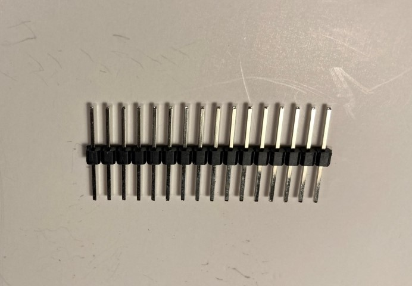
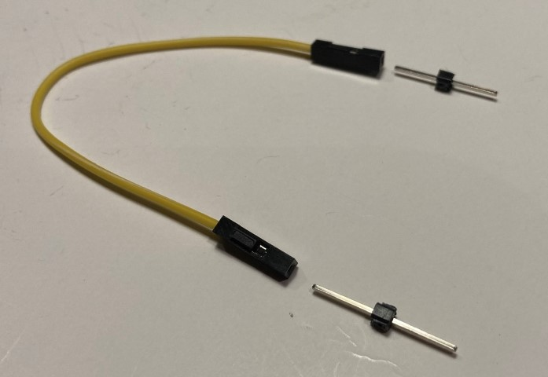
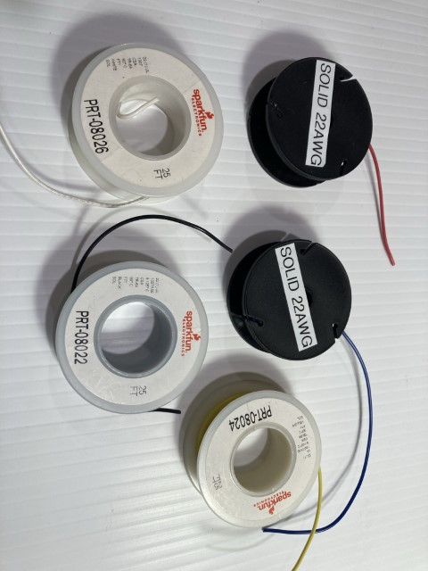
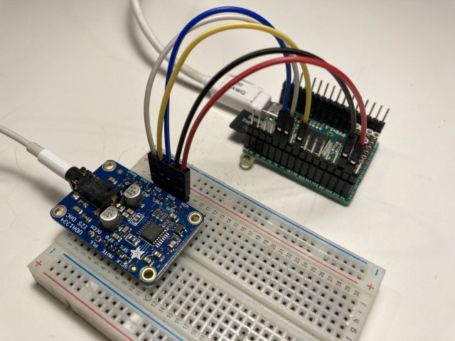
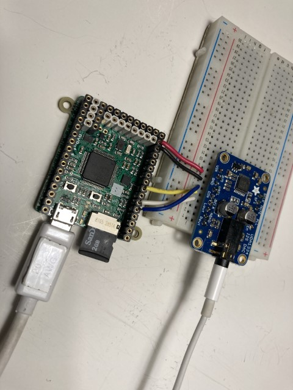
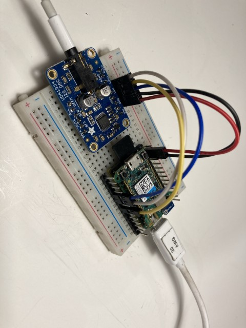
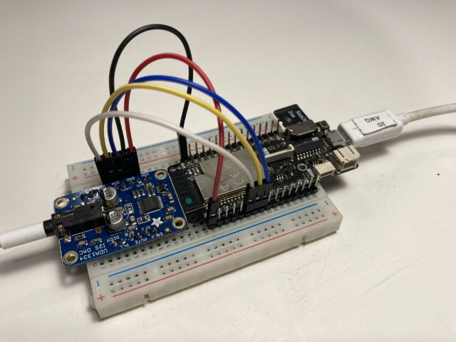
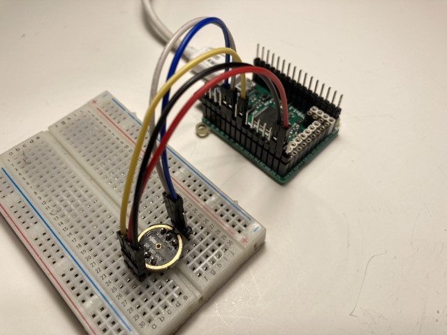
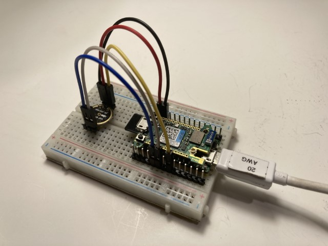
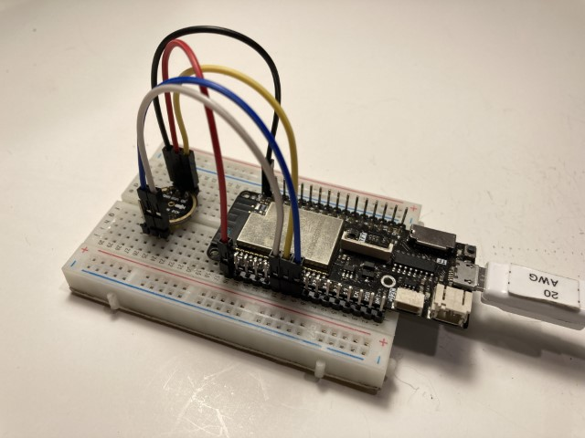

# MicroPython I2S Examples

This repository provides MicroPython example code, showing how to use the I2S protocol with development boards supporting MicroPython.  The I2S protocol can be used to play WAV audio files through a speaker or headphone, or to record microphone audio to a WAV file on a SD card. 

The examples are supported on 3 ports:  STM32, ESP32, RP2.  

To use I2S with MicroPython you will need to download a [MicroPython build](https://micropython.org/download/) and program the development board.  I2S has been available since v1.17.

The I2S feature is currently in a Technology Preview phase and may undergo changes as feedback is received from users. 

#### Boards Tested
  * Pyboard D SF2W
  * Pyboard V1.1
  * Adafruit Huzzah Feather ESP32 with external SD card
  * Lolin D32 Pro
  * Lolin D32 with external SD card
  * TinyPico with external SD card
  * Raspberry Pi Pico
  
#### I2S Microphone Boards Tested
 * INMP441 microphone module available on ebay, aliexpress, amazon
 * MSM261S4030H0 microphone module available on ebay, aliexpress, amazon
 * Adafruit I2S MEMS Microphone Breakout - SPH0645LM4H. See Workaround note below.
  
#### I2S DAC and Amplifier Boards Tested
   * Adafruit I2S 3W Class D Amplifier Breakout - MAX98357A
   * Adafruit I2S Stereo Decoder - UDA1334A Breakout
   * I2S PCM5102 Stereo DAC Decoder available on ebay, aliexpress, amazon
   * Wondom 2 x 30W Class D Audio Amplifier Board & DAC, based on TI TAS5756 device
   
#### Quick Start - play an audio tone through ear phones
The easiest way to get started with I2S is playing a pure tone to ear phones using a DAC board such as the I2S UDA1334A breakout board or the I2S PCM5102 Stereo DAC Decoder board.  Here are the steps:

1. Download and program the appropriate firmware that supports the I2S protocol into the MicroPython development board
1. Load the example code `play_tone.py` into a text editor, found in the [examples](examples) folder
1. Make the following wiring connections using a quality breadboard and jumper wires.  Use the GPIO pins that are listed in the example code file.  Refer to the section on `Hardware Wiring Recommendations` below.

    |UDA1334A board pin|Pyboard V1.1 pin|Pyboard D pin|ESP32 pin|Pico Pin|
    |--|--|--|--|--|
    |3V0|3V3|3V3|3V3|3V3|
    |GND|GND|GND|GND|GND|
    |BCLK|Y6|Y6|32|16|
    |WSEL|Y5|Y5|25|17|
    |DIN|Y8|Y8|33|18|

    |PCM5102 board pin|Pyboard V1.1 pin|Pyboard D pin|ESP32 pin|Pico Pin|
    |--|--|--|--|--|
    |VIN|3V3|3V3|3V3|3V3|
    |GND|GND|GND|GND|GND|
    |SCK|GND|GND|GND|GND|
    |BCK|Y6|Y6|32|16|
    |LCK|Y5|Y5|25|17|
    |DIN|Y8|Y8|33|18|
    
1. Establish a REPL connection to the board
1. Copy the code from the editor e.g.  ctrl-A, ctrl-C
1. Ctrl-E in the REPL
1. Paste code into the REPL
1. Ctrl-D in the REPL to run the code
1. Result: the tone should play in the ear phones
1. Try different tone frequencies

### MicroPython examples
MicroPython example code is contained in the [examples](examples) folder.  WAV files used in the examples are contained in the [wav](wav) folder.

Each example file has configuration parameters, marked with

`# ======= AUDIO CONFIGURATION =======`

and 

`# ======= I2S CONFIGURATION =======`

#### PyBoard GPIO Pins

All Pyboard V1.1 and Pyboard D examples use the following I2S peripheral ID and GPIO pins

|I2S ID|SCK pin|WS pin|SD pin|
|--|--|--|--|
|2|Y6|Y5|Y8|

To use different GPIO mappings refer to the sections below

#### ESP32 GPIO Pins

All ESP32 examples use the following I2S peripheral ID and GPIO pins

|I2S ID|SCK pin|WS pin|SD pin|
|--|--|--|--|
|0|32|25|33|

To use different GPIO mappings refer to the sections below

#### Raspberry Pi Pico GPIO Pins

All Pico examples use the following I2S peripheral ID and GPIO pins

|I2S ID|SCK pin|WS pin|SD pin|
|--|--|--|--|
|0|16|17|18|

To use different GPIO mappings refer to the sections below

#### Easy WAV Player example
The file `easy_wav_player.py` contains an easy-to-use micropython example for playing WAV files.  This example requires
an SD card (to store the WAV files).  Pyboards have a built in SD card.  Some ESP32 development boards have a built-in SD Card, such as the Lolin D32 Pro.  Other devices, such as the TinyPico and Raspberry Pi Pico require an external SD card module to be wired in.  Additionally, for the Raspberry Pi Pico [sdcard.py](https://github.com/micropython/micropython/blob/master/drivers/sdcard/sdcard.py) needs to be copied to the Pico's filesystem to enable SD card support.

Instructions
1. Wire up the hardware.  e.g.  connect the I2S playback module to the development board, and connect an external SD Card Module (if needed).  See tips on hardware wiring below.  The example uses the default GPIO pins outlined above.  These can 
be customized, if needed.
1. copy file `wavplayer.py` to the internal flash file system using a command line tool such as ampy or rshell.
1. copy the WAV file(s) you want to play to an SD card.  Plug the SD card into the SD card Module.
1. configure the file `easy_wav_player.py` to specify the WAV file(s) to play
1. copy the file `easy_wav_player.py` to the internal flash file system using a command line tool such as ampy or rshell.
1. run `easy_wav_player.py` by importing the file into the REPL.  e.g.  import easy_wav_player
1. try various ways of playing a WAV file, using the `pause()`, `resume()`, and `stop()` methods

MP3 files can be converted to WAV files using online applications such as
[online-convert](https://audio.online-convert.com/convert-to-wav)

WAV file tag data can be inspected using a downloadable application such as
[MediaInfo](https://mediaarea.net/en/MediaInfo).
This application is useful to check the sample rate, stereo versus mono, and sample bit size (16, 24, or 32 bits)

#### Pyboard GPIO mappings for SCK, WS, SD

On Pyboard devices I2S compatible GPIO pins are mapped to a specific I2S hardware bus.  The tables below show this mapping.  For example, the GPIO pin "Y6" can only be used with I2S ID=2. 

Pyboard D with MicroPython WBUS-DIP28 adapter

|I2S ID|SCK pin|WS pin|SD pin|
|--|--|--|--|
|1|X6,W29|X5,W16|Y4|
|2|Y1,Y6,Y9|Y3,Y5|Y8,W24|

Pyboard V1.0/V1.1

|I2S ID|SCK pin|WS pin|SD pin|
|--|--|--|--|
|2|Y6,Y9|Y4,Y5|Y8,X22|

#### ESP32 GPIO mappings for SCK, WS, SD

All ESP32 GPIO pins can be used for I2S, with attention to special cases:
*   GPIO34 to GPIO39 are input-only
*   GPIO strapping pins:  see note below on using strapping pins

Strapping Pin consideration:
The following ESP32 GPIO strapping pins should be **used with caution**.  There is a risk that the state of the attached hardware can affect the boot sequence.  When possible, use other GPIO pins.
*   GPIO0 - used to detect boot-mode.  Bootloader runs when pin is low during powerup. Internal pull-up resistor.
*   GPIO2 - used to enter serial bootloader.  Internal pull-down resistor.
*   GPIO4 - technical reference indicates this is a strapping pin, but usage is not described.  Internal pull-down resistor.
*   GPIO5 - used to configure SDIO Slave.  Internal pull-up resistor.
*   GPIO12 - used to select flash voltage.  Internal pull-down resistor.
*   GPIO15 - used to configure silencing of boot messages.  Internal pull-up resistor.

#### Raspberry Pi Pico GPIO mappings for SCK, WS, SD

All Pico GPIO pins can be used for I2S, with one limitation.  The WS pin number must be one greater than the SCK pin number. 

### Hardware Wiring Recommendations

I have found the best audio quality is acheived when:

1. wires are short
1. modules are connected with header pins and 10cm long female-female jumpers, OR
1. solid core 22 AWG wire

The following images show example connections between microcontroller boards and breakout boards.  The following colour conventions are used for the signals:

|Signal|Colour|
|--|--|
|+3.3V|Red|
|GND|Black|
|SCK|White|
|WS|Blue|
|SD|Yellow|

#### UDA1334A DAC board with Pyboard V1.1

Connections made with Female-Female jumpers and header pins

Connections made with 22 AWG wire

#### UDA1334A DAC board with Pyboard D

Connections made with Female-Female jumpers and header pins

#### UDA1334A DAC board with ESP32

Connections made with Female-Female jumpers and header pins

### INMP441 microphone board with Pyboard V1.1

Connections made with Female-Female jumpers and header pins

### INMP441 microphone board with Pyboard D

Connections made with Female-Female jumpers and header pins

### INMP441 microphone board with ESP32

Connections made with Female-Female jumpers and header pins

 
### Workaround for Adafruit I2S MEMS Microphone Breakout - SPH0645LM4H
This is a well designed breakout board based on the SPH0645LM4H microphone device. Users need to be aware that the SPH0645LM4H device implements non-standard Philips I2S timing.  When used with the ESP32, all audio samples coming from the I2S microphone are shifted to the left by one bit. This increases the sound level by 6dB. More details on this problem are outlined a [StreetSense project log](https://hackaday.io/project/162059-street-sense/log/160705-new-i2s-microphone).  
Workaround:  Use the static I2S class method `shift()` to right shift all samples that are read from the microphone.